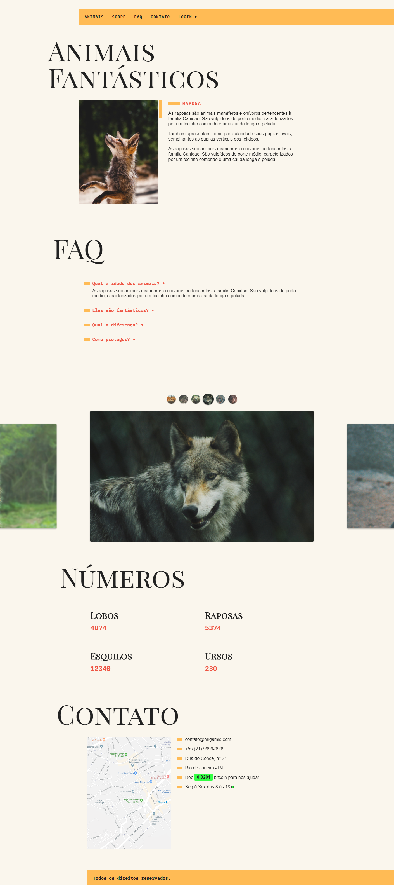

<h1 align="center">Fantastic Animals<br>
</h1>

## 🔖 Descrição
🐺 Creation of the Fantastic Animals website to put into practice the knowledge learned in Origamid's ES6 JavaScript course.


📦 Course and materials available at: [Origamid - JavaScript ES6](https://www.origamid.com/curso/javascript-completo-es6)

---

## 🚀 Technologies


---

## ℹ️ Como usar
```bash
# Clone this repository
$ git clone (https://github.com/luanrramos/fantastic-animals.git)

# Install dependencies
index.html
$ npm install

# Open the file
index.html
```
---

## 🖼 Layout
<p align="center"></p> 
